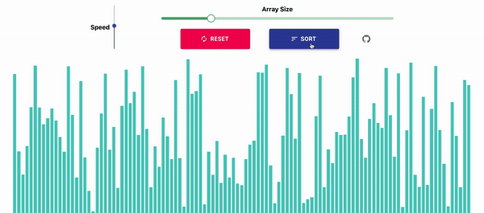

<h1 align="center">
  SightSort
</h1>

SightSort is a web application designed to help visualize various sorting algorithms, including Quicksort, Merge Sort, Insertion Sort, Bubble Sort, and Selection Sort. Visit the project at https://sightsort.netlify.app/.

<h2>Features</h2>

<p align="center">
  <b>Select from five popular sorting methods, specify an array size of up to 500, and control animation speed.</b>
  <br><br>
  
</p>

#
<br>

<p align="center">
  <b>Press 'Sort' to begin a visualization of your selected sorting method.</b>
  <br><br>
  
</p>

<h2>Development</h2>

* Install [Node JS](https://nodejs.org/en/) if necessary
* Install the ```create-react-app``` [npm package](https://github.com/facebook/create-react-app) with the following command:
```bash
npm install -g create-react-app
```
* Clone the repository ```https://github.com/Fraisin/SightSort.git```
* Go into the project directory and run ```npm install``` to install the required npm packages
* Run ```npm start``` to launch the application
* Navigate to ```http://localhost:3000/``` in a browser to view changes in real-time

<h2>Built With</h2>

* [ReactJS](https://reactjs.org/)
* [Material-UI](https://material-ui.com/)
